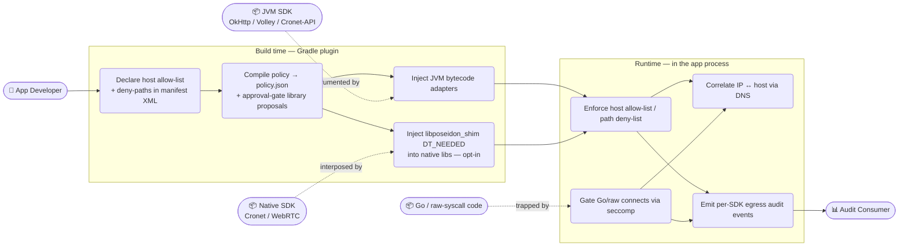
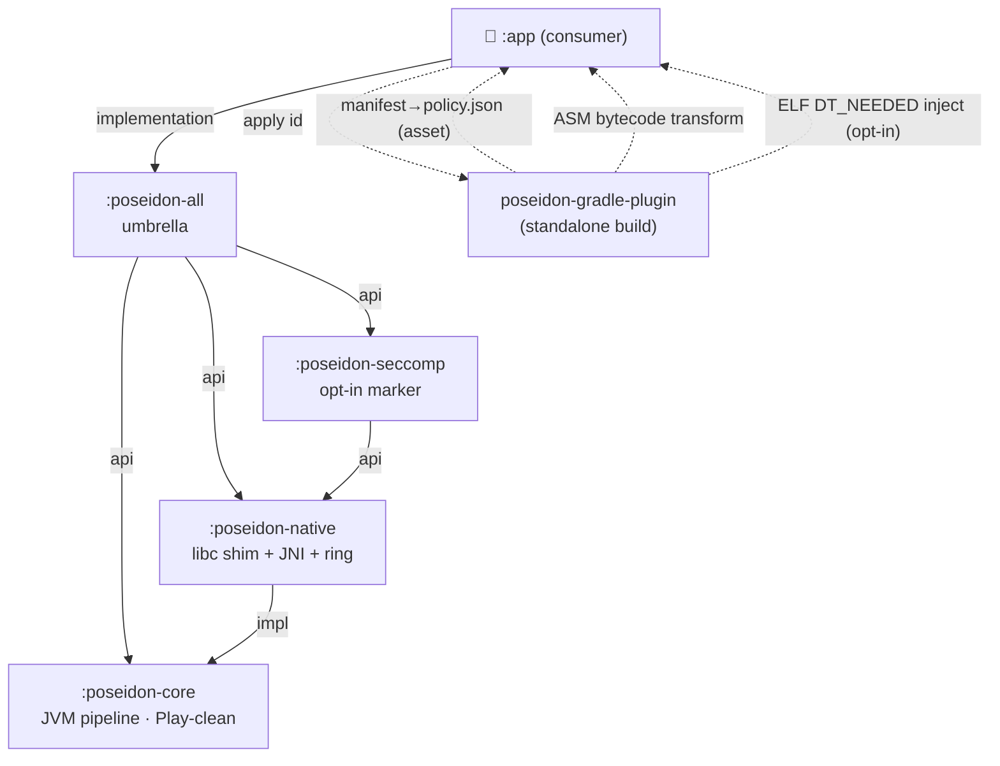
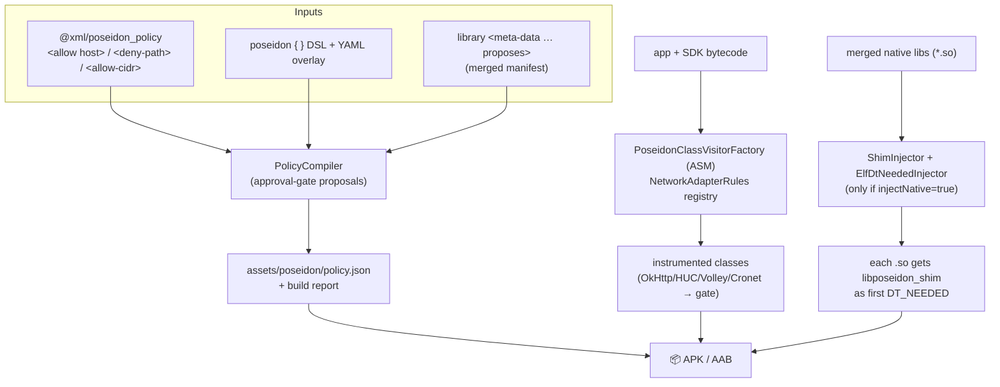
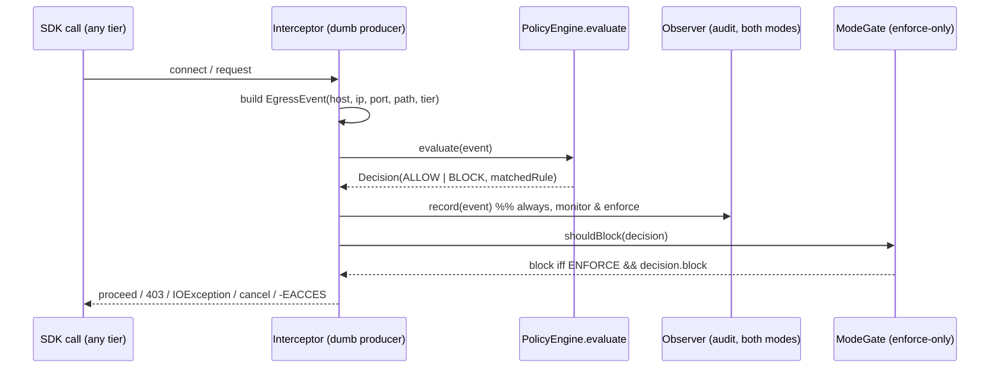
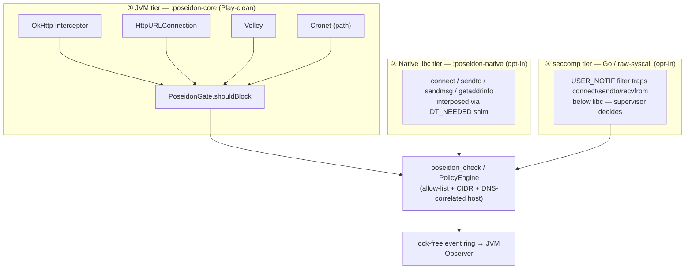
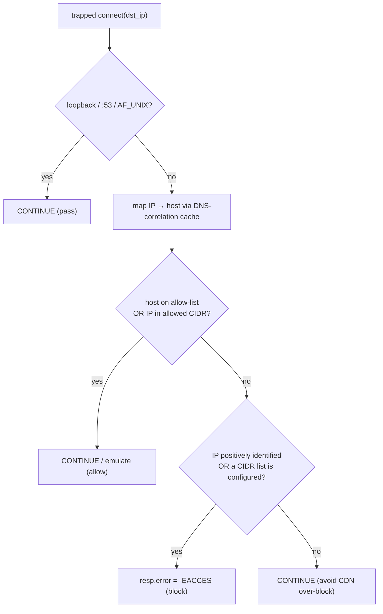

# Poseidon — Architecture

Poseidon is a **build-time + runtime network-egress control** for Android. An app author
declares which hosts their integrated third‑party SDKs may reach; Poseidon audits exactly
what each SDK actually reaches and optionally blocks anything off the list — across **JVM,
native (C/C++), and Go/raw‑syscall** code, **in‑process**, with **no VPN and no root**.

- **Audit and enforce are co‑equal modes.** Monitor produces a per‑SDK egress map; enforce
  additionally blocks. Same pipeline.
- **Manifest‑first, app‑authoritative policy.** The allow‑list is declared in the app
  manifest; libraries may *propose* needs; the build compiles and reports.
- **Layered, opt‑in coverage.** A Play‑clean JVM core stands alone; native (libc) and
  seccomp (Go/raw) tiers layer on top, each carrying its own cost/risk.

> This is a **safeguard for non‑adversarial SDKs + an audit**, not a security boundary
> against hostile same‑privilege code. See [Honest limits](#honest-limits).

---

## 1. Use cases



| Actor | Goal |
|---|---|
| **App Developer** | Declare which hosts are allowed; choose tiers (`injectNative`, CIDR, DNS-correlation); ship. |
| **JVM SDK** | Makes HTTP calls via OkHttp / HttpURLConnection / Volley / Cronet — gated at the bytecode layer. |
| **Native SDK** | Makes libc socket calls — gated by the interposed shim (opt-in). |
| **Go / raw-syscall code** | Bypasses libc — gated by the seccomp `USER_NOTIF` filter (opt-in). |
| **Audit Consumer** | Receives a normalized stream of allow/block egress events (default: Logcat; pluggable). |

---

## 2. Module architecture



| Module | Contents | Cost / risk | Required |
|---|---|---|---|
| **`:poseidon-core`** | `EgressEvent` pipeline (`PolicyEngine` → `Observer`/`ModeGate`), manifest policy loader, JVM HTTP adapters, `NativeBridge` seam | none — no binary modification | ✅ yes |
| **`:poseidon-native`** | libc shim (`connect`/`sendto`/`getaddrinfo`…), `NativeShimBackend` (JNI), lock-free audit ring | binary modification → Play/licensing posture | opt-in |
| **`:poseidon-seccomp`** | marker for the Go/raw tier (the gate ships *inside* `libposeidon_shim.so`) | per-connect/datagram cost; kernel ≥ 5.0 | opt-in |
| **`:poseidon-all`** | umbrella: `api(core + native + seccomp)` | — | convenience |
| **`poseidon-gradle-plugin`** | manifest→policy compile, ASM transform, ELF inject task | — | ✅ yes |

The **`core` + `plugin`** story is **Play‑clean and stands alone** (no binary modification;
`injectNative` defaults to `false`). The runtime classes live in a **frozen package**
`tech.ssemaj.poseidon.runtime` (load‑bearing for JNI symbols, the plugin's injected FQN
literals, `consumer-rules`, the manifest, and a reflective lookup), organised into
responsibility sub‑packages: `model · policy · config · pipeline · adapter · internal`.

---

## 3. Build-time pipeline



The native injection runs **post-strip / pre-package** (in `stripped_native_libs`), so AGP
signs once — no re-sign.

---

## 4. Runtime — the decoupled pipeline

Every egress decision flows through one source-agnostic event and one decision point.



**Invariants:** interceptors never decide · `PolicyEngine` is the only decision-maker ·
`Observer` is async and runs in both modes · `ModeGate` only gates · path enforcement is
JVM‑tier only (the only layer above TLS that sees the URL) · host enforcement is every tier.

---

## 5. The three enforcement tiers



| Tier | Covers | Sees the path? | How it binds |
|---|---|---|---|
| **JVM bytecode** | OkHttp (=Retrofit/Ktor‑OkHttp), HttpURLConnection (=Volley HurlStack/Ktor‑Android), Volley, Cronet‑Java‑API | ✅ (above TLS) | ASM transform at build |
| **libc shim** | any native SDK reaching the net through libc (Cronet, WebRTC, …) | ❌ (ciphertext) | ELF `DT_NEEDED` injection |
| **seccomp** | Go runtimes & raw `syscall()` that bypass libc | ❌ | `SECCOMP_RET_USER_NOTIF` on our own process |

### seccomp connect decision (positive-identity + opt-in CIDR)



Without a CIDR list, an *un‑correlated bare‑IP* connect passes (positive‑identity only, so
rotating CDNs aren't over‑blocked). Declaring `<allow-cidr>` flips the unknown‑IP default
back to **deny**, closing that residual for IPs outside the declared ranges.

---

## 6. Native shim internals (`poseidon-native/src/main/cpp`)

One `libposeidon_shim.so`, split into focused translation units by subsystem:

```
cpp/
├── include/     shim_internal.h · event_ring.h · host_match.h   (cross-TU contract)
├── interpose/   interpose.c        libc DT_NEEDED wrappers + reentrancy guard
├── policy/      policy_eval.c      allow-list + CIDR + verdict (owns g_lock)
├── dns/         dns_cache.c        IP↔host correlation cache + DNS packet parsing
├── seccomp/     seccomp_supervisor.c   USER_NOTIF gate, BPF program, notif handlers
├── audit/       event_ring.c       lock-free MPSC ring (drains to the JVM Observer)
├── jni/         jni_bridge.c       the 10 Java_…_NativeShimBackend_* exports
└── linker/      poseidon.ver       version script (exports @@LIBC symbols)
```

**Hot-path rule (mandatory):** nothing in the interposed/trapped path may log
synchronously, take a lock, or allocate — observability is pushed into the lock‑free ring
and drained off‑thread by a JVM daemon (~250 ms), which symbolizes the origin `.so`
(`dladdr`) and feeds the unified `Observer`.

---

## 7. Underlying techniques

1. **ELF `DT_NEEDED` interposition (build-time).** Each native `.so` is rewritten so
   `libposeidon_shim.so` is its *first* `DT_NEEDED`; the bionic linker then resolves that
   lib's libc network imports to the shim. Pure build-time assembly of the app's own
   binaries — no runtime PLT/inline patching, no `LD_PRELOAD`, no system-lib modification.
   Symbols are exported at version node `LIBC` so they satisfy versioned imports
   (e.g. Cronet's `connect@LIBC`). A pure-Kotlin `ElfDtNeededInjector` appends a relocated
   `PT_LOAD`/phdr/`.dynamic`/`.dynstr` (no LIEF/python).
2. **ASM bytecode transform (build-time).** An AGP `AsmClassVisitorFactory` rewrites HTTP
   clients to route through Poseidon: an entry-inject at `OkHttpClient$Builder.build()`, and
   call-site rewrites for `URL.openConnection`, Volley `RequestQueue.add`, and Cronet
   `newUrlRequestBuilder`. Adapter rules are a one-file registry (`NetworkAdapterRules`).
3. **seccomp `USER_NOTIF` (runtime).** The app installs a `SECCOMP_RET_USER_NOTIF` filter on
   *its own* process trapping `connect`/`sendto`/`recvfrom` **below libc** — the only
   in-process way to cover Go runtimes and raw `syscall()`. A supervisor thread (kept
   unfiltered) reads the sockaddr and decides. Legitimate kernel primitive, no other-process
   tampering, no VPN consent.
4. **In-process DNS correlation.** `getaddrinfo`/`gethostbyname` hooks and seccomp-trapped
   `sendto/recvfrom :53` build an IP→hostname cache, so a later connect to a bare IP can be
   mapped back to the host the policy is written in.
5. **Opt-in CIDR allow-list.** `<allow-cidr>` ranges (v4/v6, masked-prefix match) let the
   operator restore IP-layer default-deny without the rotating-CDN over-block — closing the
   un-correlated bare-IP residual for addresses outside the declared ranges.
6. **Lock-free MPSC event ring.** Native egress events are published (CAS-reserve +
   per-slot release/acquire seq, drop-on-full) into a fixed ring and drained by the JVM —
   keeping the connect hot path log/lock/alloc-free.
7. **Manifest-first compiled policy.** The app's `@xml/poseidon_policy` is app-authoritative;
   library `proposes` meta-data is recorded but **not granted** unless approved; the plugin
   emits `policy.json` + a human-readable build report (with a warn/error CI gate).
8. **Decoupled pipeline (design patterns).** Adapter · Bridge (`NativeBridge`) · Observer ·
   Facade (`PoseidonGate`) · Proxy (the shim) · Decorator (`PoseidonInterceptor`) · Visitor
   (the ASM factory).

---

## Coverage envelope

| Traffic | Host enforce | Path enforce | Audit |
|---|---|---|---|
| OkHttp / Retrofit / Ktor-OkHttp | ✅ JVM | ✅ | ✅ |
| HttpURLConnection / Volley / Ktor-Android | ✅ JVM | ✅ | ✅ |
| Cronet (Java API) | ✅ native + ✅ JVM observe | ✅ at Java API | ✅ |
| Native libc SDK (WebRTC…) | ✅ libc shim | ❌ (ciphertext) | ✅ |
| Go / raw `syscall()` | ✅ seccomp (DNS-correlated / CIDR) | ❌ | ✅ |

## Honest limits

- **Exfiltration through an allow-listed host** — destination control only; no payload/TLS
  inspection (no MITM by design).
- **Hostile same-privilege SDK** — can tamper with in-process state or race the filter
  install. In-process is **not** a security boundary against adversarial code (only
  kernel/MDM/network is). io_uring is denied and connect is TOCTOU-safe, but the class
  remains.
- **Kernels < 5.0** — no seccomp `USER_NOTIF`; Go/raw is ungated there (libc + DNS still
  enforce for libc code).
- **DoH / DoT** — hides the name from correlation; the connect to the resolved IP is still
  gated. ECH will hide SNI.
- **Un-correlated bare-IP raw/Go connect** — passes unless an `<allow-cidr>` list is
  declared (then anything outside the ranges is blocked); CIDR allow is host-agnostic
  *within* a range.

Positioning: **strong default-deny egress control + per-SDK audit for non-adversarial
SDKs** — not a guarantee against a hostile SDK or exfil via permitted destinations.

> Validated on a real Pixel 6 Pro (Android 16) across all tiers. The Gradle plugin builds
> standalone (consumed via `mavenLocal`); the runtime package `tech.ssemaj.poseidon.runtime`
> is frozen — see `settings.gradle.kts` for the taxonomy and what pins it.
